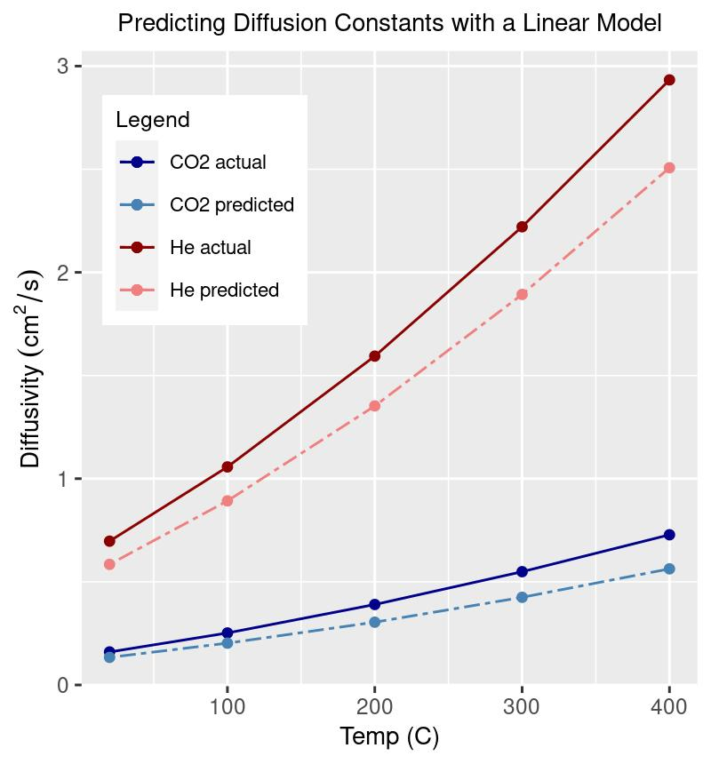

# Overview
Diffusion constants are predicted at several temperatures for two different types of gases using a linear least squares method.

# Prediction methods
- Linear least squares model
- See "analysis.R" for details
- Feature vector data was assembled for 7 small molecules with known diffusion constants at 5 different temperatures
- The model (coefficient) matrix was solved using 5 of the molecules and tested against the 2 remaining molecules (CO2 and He)

# Feature Selection
- Done manually
- Features: 1 / (molar mass)^0.5, 1/(molecular volume)^1/3, dipole moment

# Summary

## Benefits of the method
- This model is easy to interpet by inspecting the size and sign of the feature coefficients. 
  - E.g. All the (1/sqrt(MM)) coefficients are positive which means that when the 1/sqrt(MM) feature increases, the diffusion constant increases. I.e. The diffusion constant "goes as" the 1/sqrt(MM) term. Since increasing the MM decreases the term, we can infer that more massive molecules diffuse more slowly than lighter molecules (and vice versa).
  - The same logic holds for the Volume term, 1/ ( Vol^(1/3) ). The diffusion constant varies in the same direction as this term, so its model coefficients are postiive.
  - All the dipole moment coefficients are negative, indicating that when all other factors are equal, a higher dipole moment with result in a lower diffusion constant. This makes sense from a molecular interaction standpoint, since molecules with stronger interaction forces with their neighbors will move more slowly through a medium. 
  - The model yields an approximation for the diffusion limit at each temperature by applying it to the (MM = 1, Volume = 0, Dipole = 0) feature vector at each temperature. 

## Drawbacks of the method
- Feature selection done manually, which is arbitrary and does not scale well.
- Domain knowledge used to improve the fit, which also does not scale well. e.g. Choice to tranform the MM term to 1/sqrt(MM).
- Non-linear relationships unknown to the analyst are not accounted for.
